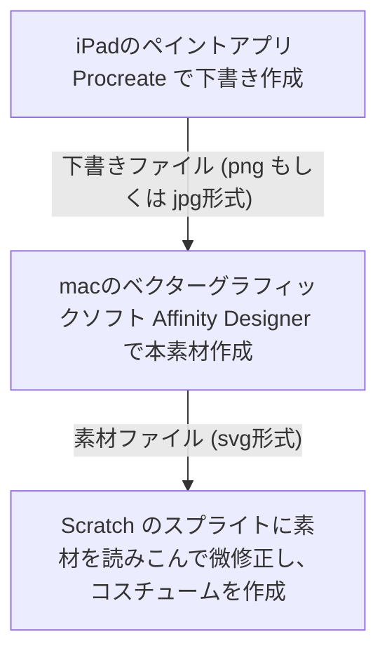

## はじめに

[CoderDojo](https://coderdojo.jp/)というボランティア団体で、子供達のプログラミングスキル習得の支援をしております。プログラミングの開発環境は、主に[Scratch](https://scratch.mit.edu)を使っていますが、チュートリアルの次のレベルの教材を充実させたいと感じており、本シリーズの執筆を開始しました。

Scratchは標準でついてくるスプライトや背景が充実しているので、その素材を使ったプログラミングから入るのが手っ取り早いですが、同じような作品ばかりになってしまうのが難点です。道場がScratchマスコットキャラクターの猫で溢れかえるような事態になりかねません😭。

一方で、オリジナルの素材を読み込んで活用するためにはいくつかハードルがあります。本シリーズではステップ・バイ・ステップでこれらのハードルを越えていきたいと思います！

:::message
本記事、(1)レテんじゃー大地に立つ！ は素材作成部分の難易度が高く、保護者、もしくは、メンター向けの内容になっています。
:::

## テレんじゃー大地に立つ❗️❗️❗️

知人の娘さんが描いた「デジタル戦隊テレんじゃー」の「テレッド」をオリジナル素材のキャラクターに採用させていただきました。「デジタル戦隊テレんじゃー」のストーリーは追々紹介しますが、先ずは素材を読み込んで簡単なアニメーションを表示するまで進めます。今回の成果物は以下になります。

Scratchのサイト: **[テレンジャー大地に立つ！](https://scratch.mit.edu/projects/721537368)**

https://youtu.be/Q7rzn2WYZ0Y

## 素材の作成

### 素材の作成方法

Scratchにオリジナル素材を組み込む方法は以下の２つがあります。

- Scratchのコスチュームエディタでオリジナルのキャラクターを描く
- Scratch以外のツールで作成したオリジナル素材を読みこんで使う

前者はScratch単体で完結するためお手軽ですが、使い慣れたツールがある人は後者を選択した方が効率的です。また、後者を応用すれば、自分以外の人が作った素材も取り込むことができます。本シリーズでは後者の方法を採用して進めます。

### ProcreateとAffinity Designerによる素材の作成

:::message alert
本シリーズの中で一番難しいのがこの素材作成です。世の中にはいろいろなツールがありますが、その中でも自分に合ったツールを選んで、自分なりの作成方法を確立しましょう。はじめは難しいと思いますので、メンターの方や保護者の方々の支援をお願いします🙇‍♂️。
:::
以降、私のやり方を紹介します。



#### 下書きの作成(Procreate)

下書きはいつもiPad ProのProcreateで作成しています。書き味もよく、操作も直感的でiPadとApple Pencilをお持ちの方におすすめのソフトです。

https://procreate.art/jp

:::message
紙にキャラクターを手書きで描いてスキャンする、といった方法も良いと思います。
:::

下書き段階ではテレッドの息子を主人公にしようと思って描いたので子供のキャラクターになっていますが😅、本素材をAffinity Designerで編集する際に、パーツの大きさを調整してお父さんのテレッドに修正しています。このくらいの単純な素材ならこのくらいラフに作成しても問題ありません。なお、以下の動画はProcreateのタイムラプス機能で作成しています。

https://youtu.be/nmFM1aSVi4s


#### 本素材の作成(Affinity Designer)

Scratchのスプライトはサイズ変更しても画像が荒くならないsvg形式の画像に対応しています。このsvg形式の画像を作成するためにはベクターグラフィックソフトが必要で、私はAffinity Designerというソフトを愛用しています。他にも有料ではAdobe Illustrator、オープンソースではInkscapeなどが有名です。

https://affinity.serif.com/ja-jp/designer

キャラクターを動くパーツ単位に分解して清書しています。左向き、右向きで絵が変わる場合は左右両方のパーツを作成、また、ボディ部は前面部と枠線部に分解し、足のパーツを挟み込むことで繋がって見えるように工夫しました。


これらのパーツを組み合わせることで色々なポーズをとることが出来ます。なお、パーツの組み合わせはScratch上で後ほど行います。


Affinity Designerを利用されている方は [このリンク](https://github.com/naoji3x/zenn/blob/main/assets/scratch/tel-red/tel-red.afdesign) からファイルをダウンロードしてご利用できます。ライセンスは[CC BY 4.0](https://creativecommons.org/licenses/by/4.0/deed.ja)で公開しています。

## 素材の書き出し

Affinity Designerでは画像の書き出しは書き出しペルソナから行います。


書き出しペルソナで各々の体のパーツをファイルに出力できるよう、レイヤータブを選択してスライスを作成します。


スライスを作成後、スライスタブを選択し、各々のスライスの書き出し設定をsvgに変更して書き出します。svg形式はScratch上でサイズ変更しても画像が荒くならないので少し面倒ですがおすすめの形式です。詳しくは [Wikipedia](https://ja.wikipedia.org/wiki/Scalable_Vector_Graphics)を参照ください。


:::message alert
Affinity Designerから出力されるsvgファイルは幅・高さが100%で指定されており、このままScratchで読み込むと意図しないサイズで取り込まれます。面倒ですがsvgファイルをテキストエディタで開き、`width="100%" height="100%"`の部分を削除してください。
:::

```xml
<?xml version="1.0" encoding="UTF-8" standalone="no"?>
<!DOCTYPE svg PUBLIC "-//W3C//DTD SVG 1.1//EN" "http://www.w3.org/Graphics/SVG/1.1/DTD/svg11.dtd">
<!-- 以下のwidth="100%" height="100%"を削除 -->
<svg width="100%" height="100%" viewBox="0 0 119 136" version="1.1" xmlns="http://www.w3.org/2000/svg" xmlns:xlink="http://www.w3.org/1999/xlink" ... >
```

ここまで来れば、後はお馴染みのScratch上での作業になります。ここまでの作業は面倒ですので、[ここからsvgファイルをダウンロード](https://github.com/naoji3x/zenn/tree/main/assets/scratch/tel-red/svg)してご利用いただくことも可能です。一括の[圧縮ファイルはこちら](https://github.com/naoji3x/zenn/blob/main/assets/scratch/tel-red/svg/tel-red-svg-files.zip)になります。

## 素材の読み込み

それではScratchを立ち上げてテレッドの画像を読み込みましょう。まずは空のスプライトを作ります。


次に、スプライトに作成したsvgファイルをアップロードします。シフトキーを押しながらファイルを選択すると一気に選択できます。


## Scratch上での素材の修正

アップロードしたsvgファイルはファイル毎にコスチュームとして読み込まれます。但し、コスチューム内で図形毎に細分化されていますので、図形を全選択してグループ化しておくと後でアニメーションを付けるときにやりやすいです。コスチュームの編集方法はこ[ちらのサイト](https://nyaablog.com/scr_cos/)にわかりやすくまとまっています。


## コスチュームの作成

次に、グループ化した図形をひとつのコスチュームにまとめて、立ち姿を作成して下さい。


## アニメーション

その後、コスチュームをコピーして、パラパラ漫画と同じようにコマ毎に手足や体の位置を調整してアニメーションを作成します。


アニメーションのコードは今回は非常にシンプルですが、「次のコスチュームにする」を「ずっと続ける」でループさせています。


## おわりに

お疲れ様でした。ようやくテレんじゃーが大地に立ちました！オリジナル素材が活用できるとグッと印象が変わってきますね！これ以降はScratch上でこれらの素材を活用した作品を作っていきます。
